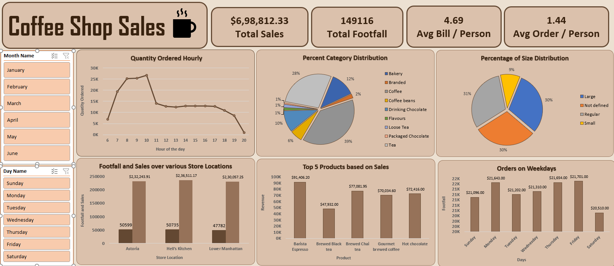

# ☕ Coffee Shop Sales Analysis - Excel Project  

  

## 📌 Project Overview  
This project analyzes coffee shop sales data to uncover trends in customer behavior, peak sales hours, product performance, and location-based revenue. Built entirely in **Microsoft Excel**, it includes:  
- **Data transformation** using Excel Power Query.  
- **Pivot tables** for aggregated summaries.  
- **Interactive dashboard** with dynamic filters and visualizations.  

## 🛠️ Tools Used  
- Microsoft Excel (Power Query, Pivot Tables, Charts)  
- GitHub (for version control and documentation)  

## 🔍 Key Insights  
1. **Peak Sales Hours**: 7 AM–10 AM on weekdays (Monday–Friday).  
2. **Top-Selling Product**: Barista Espresso ($91,406 in revenue).  
3. **Location Performance**: Astoria generates the highest revenue ($232,243.91) despite fewer visitors.  
4. **Category Trends**: Coffee dominates sales (39% of total revenue).  
5. **Customer Spending**: Average of $4.60 per visit.  

## 📂 Files Description  
### `/data` Folder  
- `CoffeeShop_Raw_Sales_Data.xlsx`: Raw transactional data (unprocessed).  
- `CoffeeShop_Analyzed_Sales_Data.xlsx`:  
  - `Transformed_Data`: Cleaned and enriched dataset using Power Query.  
  - `Pivot_Tables`: Summarized sales by day, product, and location.  
  - `Interactive_Dashboard`: Dynamic dashboard with filters and charts.  

### `/docs` Folder  
- `CoffeeShop_Analysis_Goals.pdf`: Original analysis objectives and questions.  
- `CoffeeShop_Sales_Insights.pdf`: Final report with actionable recommendations.  

### `/images` Folder  
- `CoffeeShop_Sales_Dashboard_Screenshot.png`: Preview of the interactive dashboard.  

## 🚀 How to Use  
1. **Download the Repository**:  
   - Clone or download the ZIP file.  
2. **Explore the Excel Files**:  
   - Open `CoffeeShop_Analyzed_Sales_Data.xlsx` to interact with the dashboard.  
   - Enable Power Query (**Data > Refresh All**) to update transformed data.  
3. **Use Dashboard Filters**:  
   - Adjust the **"Month Name"** filter to analyze monthly trends.  
   - Explore sales by location, product, or time of day.  
4. **Review Insights**:  
   - Check `CoffeeShop_Sales_Insights.pdf` for detailed findings and recommendations.  

## 📊 Dashboard Features  
- **Hourly/Daily Trends**: Line charts showing peak sales periods.  
- **Product Performance**: Bar charts ranking top-selling items.  
- **Location Comparison**: Tables comparing visitor counts and revenue across stores.  

## 📄 Full Report  
For detailed insights, refer to the [Sales Insights Report](./docs/CoffeeShop_Sales_Insights.pdf).  

---

**Note**: Ensure Excel macros and Power Query are enabled for full functionality.  
